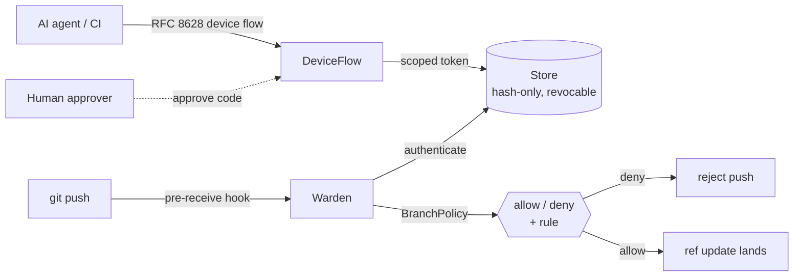

# repo-warden

[](https://github.com/cognis-digital/repo-warden/actions/workflows/ci.yml)

> Part of the **[Accountable AI Engineering suite](https://github.com/cognis-digital/accountable-ai-suite)** — provable governance for AI agents on infrastructure you own.

**Access governance for the git repositories you already host. RFC 8628 device-flow auth, scoped revocable tokens, and branch protection you can drop in as a `pre-receive` hook — no forge migration.**

Ask yourself:

- Are AI agents and humans pushing to the **same repos**, with the same blunt credentials and no per-action limits?
- If an agent force-pushed `main` tonight, would anything **stop it** — or would you find out tomorrow?
- Can you hand an agent access that's **scoped to one repo and instantly revocable**, without standing up a new git host?

You don't need to move off GitHub or GitLab to fix that. `repo-warden` is a thin authorization layer over the remotes you already run, so human pushes and agent access flow through one controlled, revocable path:

- **Device-flow onboarding (RFC 8628).** Agents and CI obtain access with the OAuth 2.0 Device Authorization Grant — the headless "here's a code, go approve it" flow — not a proprietary token handshake or an embedded secret.
- **Scoped, revocable tokens bound to a namespace.** A token carries scopes (`repo:read`, `branch:push`, `branch:admin`, …) and a repo namespace glob (`acme/*`). Only a hash is stored; revocation is immediate.
- **Branch protection as policy.** Protected branches, force-push, and deletion are governed by an explicit policy and evaluated per operation.
- **Drop-in enforcement.** Wire it as a server-side `pre-receive` hook on any git host and rejected pushes fail exactly where they should.
- **Zero dependencies.** Pure standard library + SQLite.




## Watch the walkthrough

A full narrated tour — setup, the tool in action, and every demo scenario:

[](https://github.com/cognis-digital/repo-warden/releases/download/walkthrough-v1/walkthrough.mp4)

▶ **[Watch the walkthrough (MP4)](https://github.com/cognis-digital/repo-warden/releases/download/walkthrough-v1/walkthrough.mp4)**

## Install

```bash
pip install -e .
```

## Device flow (how an agent gets a token)

```bash
# 1. The agent/CI starts authorization
repo-warden device start --client ci-runner --scopes "branch:push" --namespace "acme/*" --db warden.db
# -> { "user_code": "BCDF-2345", "verification_uri": "...", "interval": 5, ... }

# 2. A human approves that code out of band
repo-warden device approve --user-code BCDF-2345 --subject alice --db warden.db

# 3. The agent polls and receives a scoped bearer token (delivered once)
repo-warden device poll --device-code <code> --db warden.db
# -> { "access_token": "rw_…", "token_type": "Bearer", "scope": "branch:push", "namespace": "acme/*" }
```

Polling respects the RFC 8628 `interval` (returns `slow_down` if you poll too fast), `authorization_pending` until approved, and `expired_token` after the lifetime.

## Authorize an operation

```bash
repo-warden authorize --token rw_… --op push --repo acme/api --branch feature/x   # allowed
repo-warden authorize --token rw_… --op push --repo acme/api --branch main        # denied: protected
```

```python
from repo_warden import Store, Warden, Action, BranchPolicy

store = Store("warden.db")
warden = Warden(store, BranchPolicy(protected=["main", "release/*"], allow_force=False))
warden.authorize(token, Action(op="push", repo="acme/api", branch="main")).allowed   # False
```

## Enforce it on a host you already run

Install as a `pre-receive` hook on your git server. It reads the standard
`<old> <new> <ref>` lines, authorizes each ref update, and rejects the push if
any is denied:

```sh
#!/bin/sh
# .git/hooks/pre-receive on the server
exec repo-warden hook --repo acme/api --db /var/lib/warden/warden.db
```

```
$ git push origin main
remote: repo-warden: DENY push refs/heads/main — push to protected branch 'main' requires branch:admin [protected-branch]
! [remote rejected] main -> main (pre-receive hook declined)
```

The agent's token is read from `$REPO_WARDEN_TOKEN`. A force-push or a branch deletion is governed by the same policy.

## Scopes & rules

| Scope | Grants |
|-------|--------|
| `repo:read` | read/clone within the namespace |
| `repo:write` | read + push to unprotected branches |
| `branch:push` | push to unprotected branches |
| `branch:admin` | push/force-push/delete protected branches |
| `repo:admin` | everything within the namespace |

Decision rules (each tagged for logging): `auth`, `namespace`, `read`, `push`, `protected-branch`, `force-push`, `delete-protected`.

## Demos

Twenty runnable scenarios in [`demos/`](demos/), spanning the happy path, the
device-flow failure modes, the authorization edges, operations/audit, and an
end-to-end agent fleet. Every one builds its own throwaway in-memory warden (or
a self-cleaning temp DB), exits 0, and doubles as a smoke test. See
[`docs/DEMOS.md`](docs/DEMOS.md) for the full write-up and
[`docs/ARCHITECTURE.md`](docs/ARCHITECTURE.md) for how the pieces fit together.

```bash
PYTHONUTF8=1 python demos/run_all.py     # all twenty, end to end
```

| # | Scenario | Audience | Shows |
|---|----------|----------|-------|
| 1 | [`01_branch_protection_gate.py`](demos/01_branch_protection_gate.py) | Platform engineering | One policy, evaluated per operation — same token, six outcomes, each rule-tagged |
| 2 | [`02_agent_device_flow.py`](demos/02_agent_device_flow.py) | AI-agent / CI onboarding | Full RFC 8628 flow: pending → slow_down → human approval → token delivered once |
| 3 | [`03_revocation_and_blast_radius.py`](demos/03_revocation_and_blast_radius.py) | Security | Issue, prove, revoke — every op fails closed immediately; only a hash is stored |
| 4 | [`04_scope_ladder.py`](demos/04_scope_ladder.py) | OSS maintainers | The access matrix of the five scopes across read/push/force/delete |
| 5 | [`05_pre_receive_hook.py`](demos/05_pre_receive_hook.py) | CI / git server operators | The drop-in `pre-receive` loop: a batch push denied atomically, then accepted |
| 6–8 | device-flow paths | SRE / approvers / client authors | Timeout & stable `expired_token`, operator denial, and `slow_down` backoff |
| 9–12 | authorization edges | Multi-tenant / governance | Namespace isolation, force-push policy, protected-delete guard, blocked escalation |
| 13–16 | operations & security | Audit / hardening | Token lifecycle, mixed-ref hook batch, hash-storage proof, invalid-input handling |
| 17–20 | end-to-end & fleet | Platform / fleet ops | Agent→CI pipeline, custom policies, persistence roundtrip, multi-agent revocation |

The full per-scenario table is in [`docs/DEMOS.md`](docs/DEMOS.md).

## Composes with the suite

Pair with [`agentledger`](https://github.com/cognis-digital/agentledger) to get a signed, tamper-evident record of every authorized (and denied) git operation, and with [`sentinel-policy`](https://github.com/cognis-digital/sentinel-policy) for an org-wide governance doctrine above the branch policy.

## Testing

```bash
pip install -e ".[dev]"
pytest -q          # 123 tests (library + CLI + demo smoke tests)
```

## License

COCL (Cognis Open Collaboration License). © Cognis Digital.

> Status: v0.1 — runnable and tested. Roadmap: ancestry-aware force-push detection in the hook, token TTL + auto-expiry, CODEOWNERS-style path rules, and a smart-HTTP proxy mode for hosts without server-side hooks.
