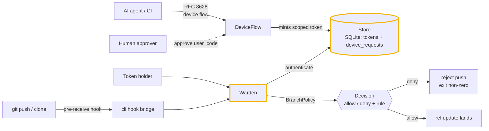
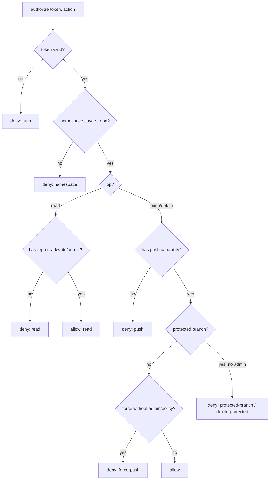
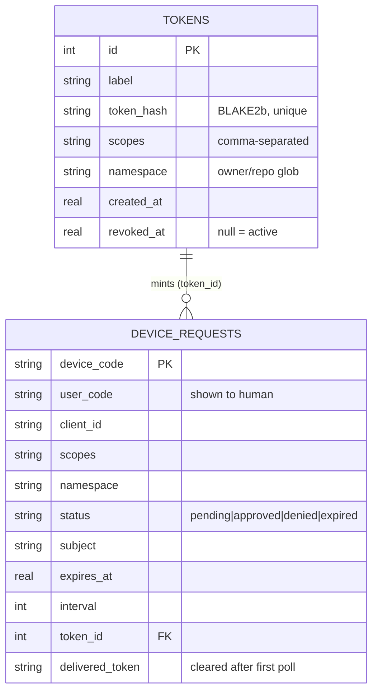

# Architecture

`repo-warden` is a thin authorization layer over git remotes you already host.
It does not replace your forge; it sits in front of the operations that touch it
so human and agent access flow through one governed, revocable path. This
document explains how the pieces fit together, end to end.

## The request path

## Components

### Store (`repo_warden/store.py`)
A single SQLite database with two tables: `tokens` and `device_requests`. Tokens
carry a scope set and a repo **namespace** glob (`acme/*`). Only a salted
BLAKE2b hash of each token is stored, so a database leak does not leak a usable
credential, and `revoke_token` is immediate — the next `authenticate` fails
closed. The store is the source of truth; it can be `:memory:` (the demos and
tests) or a file you mount into a hook.

### Device flow (`repo_warden/deviceflow.py`)
The OAuth 2.0 Device Authorization Grant (RFC 8628), the headless "here's a
code, go approve it" flow that fits agents and CI runners with no browser.
`start_authorization` issues a short `user_code`; the client `poll`s while a
human `approve`s out of band. The standard RFC error codes are returned verbatim
— `authorization_pending`, `slow_down` (the polling interval is enforced),
`expired_token`, `access_denied` — so off-the-shelf device-flow clients work
unchanged. On approval the grant mints a scoped token via the store and delivers
the plaintext **exactly once**.

### Warden (`repo_warden/warden.py`)
The decision engine. Given a presented token and an intended `Action`
(`op` ∈ {read, push, delete}, repo, branch, force), it returns a `Decision`
tagged with the **rule** that produced it. Namespaces are checked first: a token
scoped to `acme/*` can never touch `other/secrets`. Then scopes and the
`BranchPolicy` decide the rest.

### Branch policy (`BranchPolicy`)
Configuration, not code: a list of protected branch globs (`main`,
`release/*`), plus `allow_force` and `allow_delete_protected` switches. It is the
one object you tune per repo or per org, and it is what the rule tags reference
when a push is rejected.

### CLI & hook bridge (`repo_warden/cli.py`)
Wraps the library as `repo-warden device|token|authorize|hook`. The `hook`
subcommand is the drop-in: installed as a server-side `pre-receive` hook, it
reads the standard `<old> <new> <ref>` lines git feeds it, classifies each as a
push or a delete (all-zero sha), authorizes it through the warden, and exits
non-zero to reject the whole atomic push if any ref is denied. The agent's token
comes from `$REPO_WARDEN_TOKEN`.

## Data model

## Why these choices

- **No forge migration.** It layers on the remotes you already run. Wire it as a
  `pre-receive` hook and the gate lives next to the repo — no host to replace.
- **SQLite, no server.** The token store is a file you can mount, copy, and back
  up. No daemon to operate, no data leaving your machine.
- **Hash-only, revoke-now.** Only a salted hash of each token is stored;
  revocation flips one column and takes effect on the next operation.
- **Decisions are tagged.** Every allow/deny carries a rule (`auth`, `namespace`,
  `protected-branch`, `force-push`, `delete-protected`, …), so a rejection is
  self-explaining and a downstream ledger can record *why*.
- **Standard library only.** Zero dependencies keeps CI green and the threat
  surface small.
